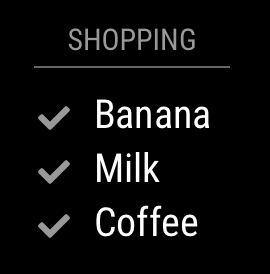

# Module: MMM-iCal-ToDo
The `MMM-iCal-ToDo` displays non-completed ToDos in the iCal format from a public or private source like ownCloud/Nextcloud through WebDAV.



## Using the module

To use this module, add it to the modules array in the `config/config.js` file:
````javascript
modules: [
	{
		module: "MMM-iCal-ToDo",
		position: "bottom_left",	// This can be any of the regions. Best results in left or right regions.
		config: {
			// The config property is optional.
			// If no config is set, an example todo is shown.
			// See 'Configuration options' for more information.
		}
	}
]
````

## Configuration options

The following properties can be configured:

| Option                       | Description
| ---------------------------- | -----------
| `header`             | The header title of the module instance. <br> **Default value:** `ToDo`
| `maximumEntries`             | The maximum number of events shown. / **Possible values:** `0` - `100` <br> **Default value:** `10`
| `displaySymbol`              | Display a symbol in front of an entry. <br><br> **Possible values:** `true` or `false` <br> **Default value:** `true`
| `defaultSymbol`              | The default symbol. <br><br> **Possible values:** See [Font Awsome](http://fontawesome.io/icons/) website. <br> **Default value:** `check`
| `animationSpeed`             | Speed of the update animation. (Milliseconds) <br><br> **Possible values:** `0` - `5000` <br> **Default value:** `2000` (2 seconds)

### ToDo configuration

The `todods` property contains an array of the configured todos.

#### Default value:
````javascript
config: {
	header: 'ToDo',
	colored: false,
	coloredSymbolOnly: false,
	todos: [
		{
			url: 'http://www.todolabs.com/templates/ical/US-Holidays.ics',
			symbol: 'check',
			auth: {
			    user: 'username',
			    pass: 'superstrongpassword',
			    method: 'basic'
			}
		},
	],
}
````

#### ToDo configuration options:
| Option                | Description
| --------------------- | -----------
| `url`	                | The url of the todo .ical. This property is required. <br><br> **Possible values:** Any public accessble .ical todo.
| `symbol`              | The symbol to show in front of an event. This property is optional. <br><br> **Possible values:** See [Font Awesome](http://fontawesome.io/icons/) website. To have multiple symbols you can define them in an array e.g. `["todo", "plane"]`
| `color`              | The font color of an event from this todo. This property should be set if the config is set to colored: true. <br><br> **Possible values:** HEX, RGB or RGBA values (#efefef, rgb(242,242,242), rgba(242,242,242,0.5)).
| `repeatingCountTitle`	| The count title for yearly repating events in this todo.  <br><br> **Example:** `'Birthday'`
| `maximumEntries`      | The maximum number of events shown.  Overrides global setting. **Possible values:** `0` - `100`
| `name`                | The name of the todo.  Included in todo broadcasts as `todoName`.
| `auth`                | The object containing options for authentication against the todo.
| `symbolClass`         | Add a class to the cell of symbol.
| `titleClass`          | Add a class to the title's cell.
| `timeClass`           | Add a class to the time's cell.
| `broadcastPastEvents` | Whether to include past events from this todo.  Overrides global setting


#### ToDo authentication options:
| Option                | Description
| --------------------- | -----------
| `user`                | The username for HTTP authentication.
| `pass`                | The password for HTTP authentication. (If you use Bearer authentication, this should be your BearerToken.)
| `method`              | Which authentication method should be used. HTTP Basic, Digest and Bearer authentication methods are supported. Basic authentication is used by default if this option is omitted. **Possible values:** `digest`, `basic`, `bearer` **Default value:** `basic`
